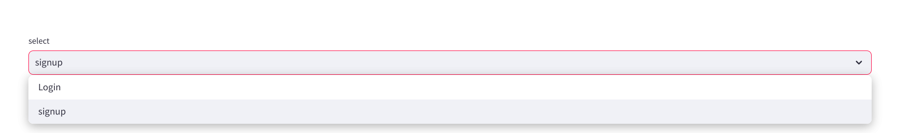
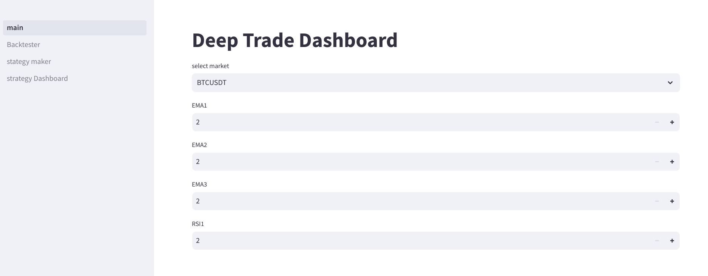
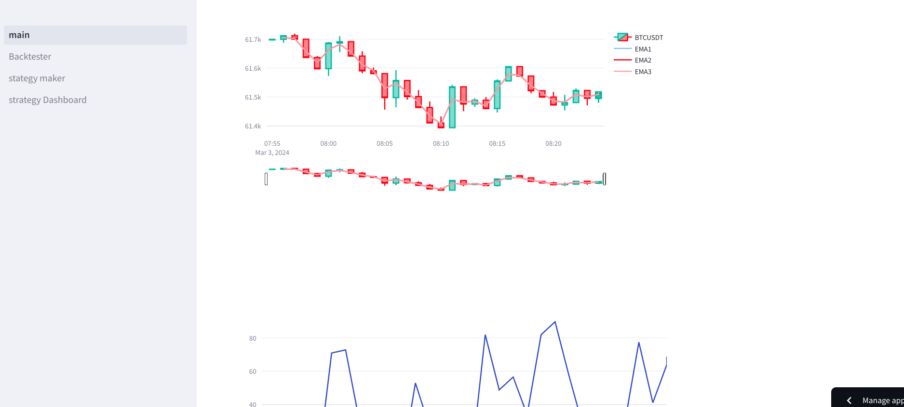
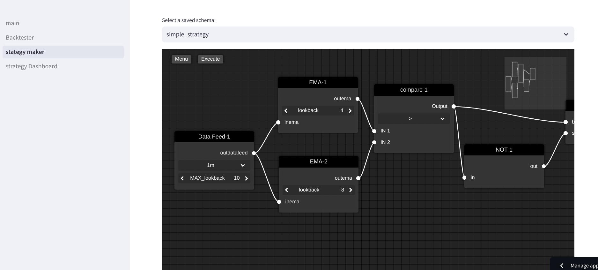
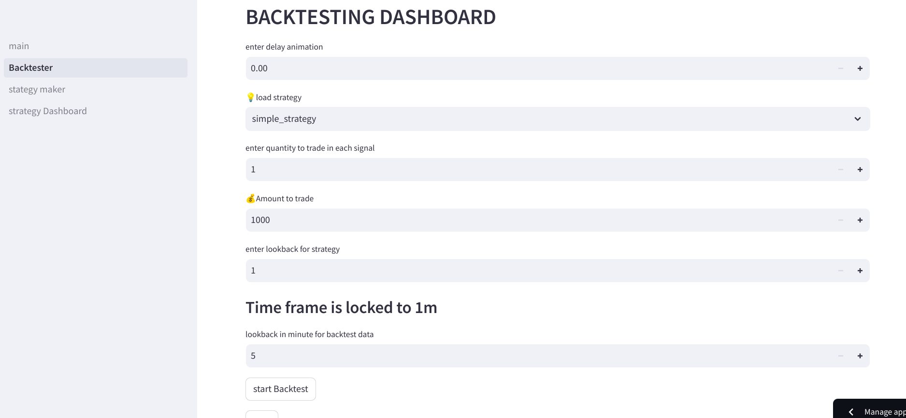
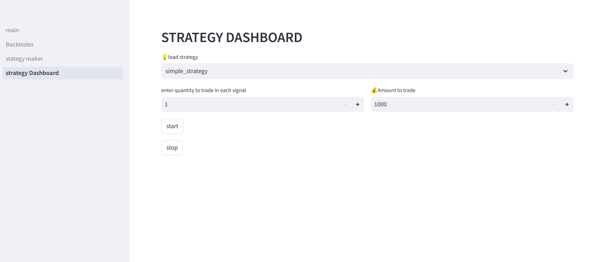

<br/>
<p align="center">
  <h3 align="center">DEEP Strategy Maker</h3>

  <p align="center">
    Merge trading strategies with DL and ML
    <br/>
    <a href="https://deep-dash.streamlit.app/">Visit demo site<a/>
    <br/>
    <a href="https://github.com/skycreeds/Deep_Strategy_maker/issues">Report Bug</a>
    .
    <a href="https://github.com/skycreeds/Deep_Strategy_maker/issues">Request Feature</a>
  </p>
</p>

     

## About The Project


This project enable you to merge your trading stategies with Deep learning or machine learning models
Its a fun projects to do and lacks many features contributions are welcomed. 

## Built With


* [keras](https://keras.io/)
* [numpy](https://numpy.org/)
* [streamlit](https://streamlit.io/)

## Getting Started

Follow the steps to install streamlit and following dependencies

### Prerequisites

*streamlit
```sh
pip install streamlit
```
*pip
```sh
pip install -r requirements.txt
```

### Installation


1. Clone the repo

```sh
git clone https://github.com/skycreeds/Deep_Strategy_maker
```

3. Run 

```sh
streamlit run main.py
```


### Get started


* Click on login or signup 


* At homepage we can preview the market condition and to update press "R" as price and chard update are static


* Home page also features charts that is candlestick charts with EMA's and a RSI charts


* At signup a preset strategy will be provided which can be expanded upon or use as a reference for further development of custom strategies


* Backtest page provide system to backtest the strategies made and provide a feedback about the performance.


* Live dashboard is used to test the strategy in live market


### TODO[upcoming features]
1. System to upload external ml/dl models
2. Connect to external API's

### Creating A Pull Request

1. Fork the Project
2. Create your Feature Branch (`git checkout -b feature/AmazingFeature`)
3. Commit your Changes (`git commit -m 'Add some AmazingFeature'`)
4. Push to the Branch (`git push origin feature/AmazingFeature`)
5. Open a Pull Request

## License

Distributed under the MIT License. See [LICENSE](https://github.com/skycreeds/Deep_Strategy_maker/blob/main/LICENSE.md) for more information.

## Authors

* **christo vincent** - *AI student* - [christo vincent](https://github.com/skycreeds) - *Deep strategy maker*

## Acknowledgements

* [christ vincent](https://github.com/skycreeds)
