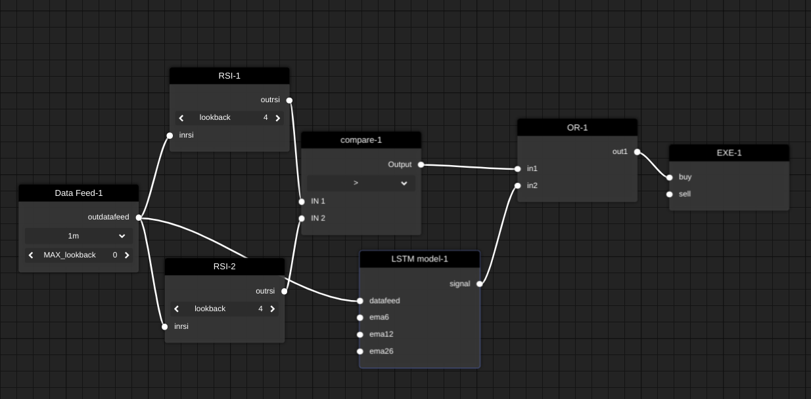

<br/>
<p align="center">
  <h3 align="center">DEEP Strategy Maker</h3>

  <p align="center">
    Merge trading strategies with DL and ML
    <br/>
    <a href="https://deep-dash.streamlit.app/">Visit demo site<a/>
    <br/>
    <a href="https://github.com/skycreeds/Deep_Strategy_maker/issues">Report Bug</a>
    .
    <a href="https://github.com/skycreeds/Deep_Strategy_maker/issues">Request Feature</a>
  </p>
</p>

     

## About The Project



This project enable you to merge your trading stategies with Deep learning or machine learning models
Its a fun projects to do and lacks many features contributions are welcomed. 

## Built With


* [keras](https://keras.io/)
* [numpy](https://numpy.org/)
* [streamlit](https://streamlit.io/)

## Getting Started

This is an example of how you may give instructions on setting up your project locally.
To get a local copy up and running follow these simple example steps.

### Prerequisites

*streamlit
```sh
pip install streamlit
```
*pip
```sh
pip install -r requirements.txt
```

### Installation


1. Clone the repo

```sh
git clone https://github.com/skycreeds/Deep_Strategy_maker
```

3. Run 

```sh
streamlit run main.py
```


## Contributing

Contributions are what make the open source community such an amazing place to be learn, inspire, and create. Any contributions you make are **greatly appreciated**.
* If you have suggestions for adding or removing projects, feel free to [open an issue](https://github.com/skycreeds/Deep_Strategy_maker/issues/new) to discuss it, or directly create a pull request after you edit the *README.md* file with necessary changes.
* Please make sure you check your spelling and grammar.
* Create individual PR for each suggestion.
* Please also read through the [Code Of Conduct](https://github.com/skycreeds/Deep_Strategy_maker/blob/main/CODE_OF_CONDUCT.md) before posting your first idea as well.

### Creating A Pull Request

1. Fork the Project
2. Create your Feature Branch (`git checkout -b feature/AmazingFeature`)
3. Commit your Changes (`git commit -m 'Add some AmazingFeature'`)
4. Push to the Branch (`git push origin feature/AmazingFeature`)
5. Open a Pull Request

## License

Distributed under the MIT License. See [LICENSE](https://github.com/skycreeds/Deep_Strategy_maker/blob/main/LICENSE.md) for more information.

## Authors

* **christo vincent** - *AI student* - [christo vincent](https://github.com/skycreeds) - *Deep strategy maker*

## Acknowledgements

* [christ vincent](https://github.com/skycreeds)

